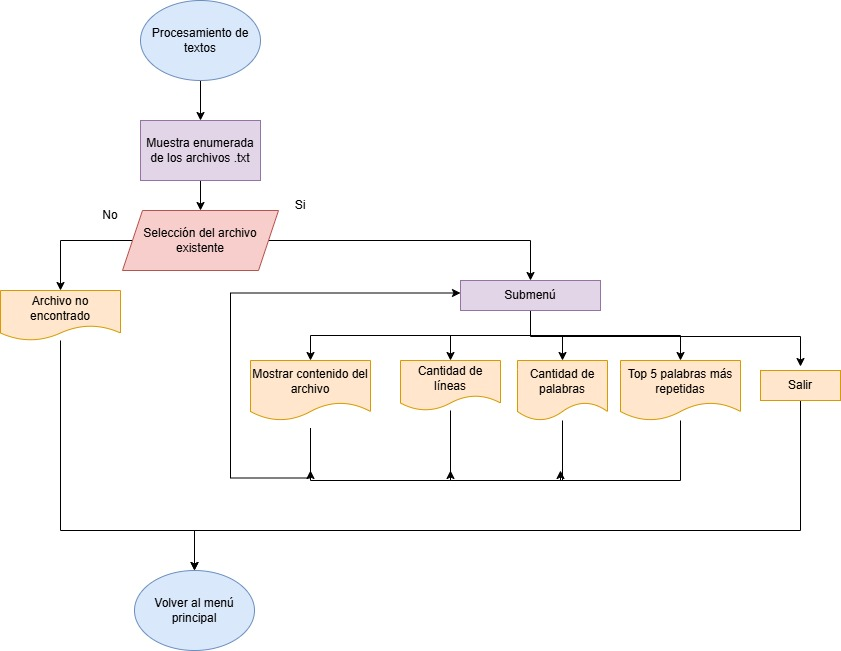

# Explorador CLI Información de Vuelos Aeropuerto Holaya Herrera (EOH)

El explorador estará basado en la información de vuelos del Aeropuerto Olaya Herrera, en Medellín. Los datos incluirán tanto las salidas como las llegadas de vuelos, mostrando información como la aerolínea, número de vuelo, fecha y hora, destino, estado del vuelo y puerta de embarque.

- Los datos sera tomadas de la página oficial del aeropuerto (EOH):
https://www.aeropuertomedellin.co/salidas-y-llegadas

## Desarrollo del programa
El programa contará con un menú principal donde el usuario(operario) podrá usar cualquiera de la opciones que le apareceran en pantalla. Estas opciones seran:

    Opciones:
        1. Explorador de directorio
        2. Procesar bitacoras / textos (.txt)
        3. Analizar dataset de archivos abiertos (.csv)
        4. Fin

El menú se desarrollará más adelante.

Los csv los quiero hacer con datos y tablas de excel (pensando si crear el csv o buscarlo)

### Menú

### Explorador de directorio
En primer lugar, se inicia solicitando al usuario una ruta donde se encuentran almacenados los archivos del sistema. Se le muestra la ruta donde están los archivos y el usuario debe seleccionar la ruta.

El programa analiza si la ruta existe
- Si la ruta no existe se le imprimara un mensaje al usuario indicando que la dirrecion es incorrecta, y le solicitara nuevamente que ingrese la ruta o que vuelva al menu principal
- Si la ruta existe se accedera al contenido de la carpetra, se le listará al usuario los archivos. 

Cuando se tengan listados los archivos, el usuario podrá elegir el archivo para conocer una corta descripción del archivo. 

### Procesamiento de textos
1) Se le muestran al usuario los posibles archivos .txt en la carpeta del aeropuerto seleccionado enumerados para hacer un submenú. Se le solicita que selecione el archivo que desea procesar.

2) Una vez seleccionado el archivo se le muestra un submenú al de procesamiento que contiene:

        - Muestra el contenido
        - Dar a conocer la cantidad de lineas
        - Dar a conocer la cantidad de palabras
        - Top 5 de palabras repetidas
        - Menú principal

3) Antes de empezar con el desarrollo del submenú anterior, se abre el archivo selecionado en modo lectura y se almacena todo el contenido del texto en una variable especifica para el analisis del documento.

4) La primera opcion del submenú imprime todo el documento tal cual como es.

5) La segunda opción muestra la cantidad de lineas que contiene el documento

6) La tercera opción muestra la cantidad de palabras que contiene el documento

7) La cuarta opción da el top 5 de las palabras repetidas.

8) Vuelta al menú principal.

