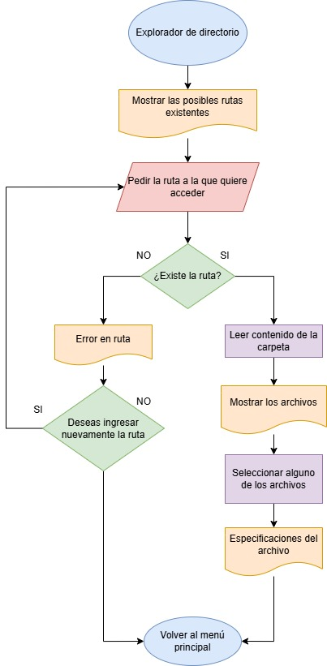
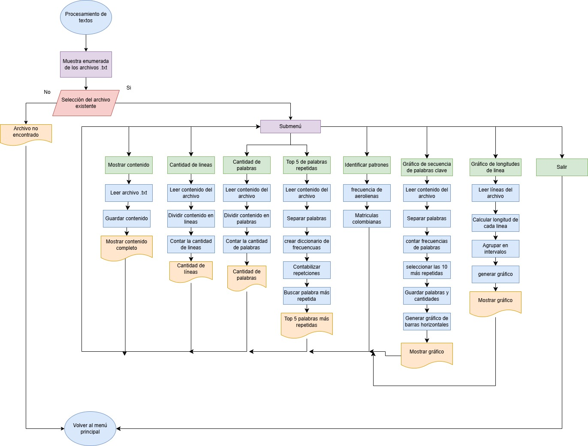
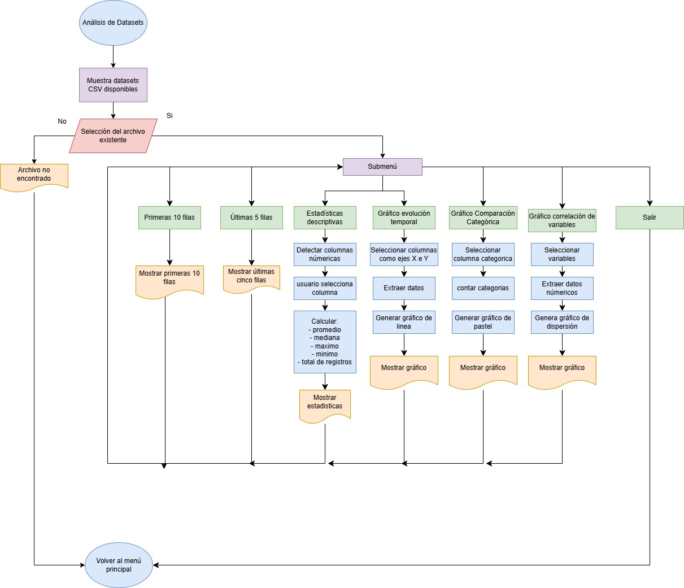

# Explorador CLI Información de Vuelos Aeropuerto Holaya Herrera (EOH)

El explorador estará basado en la información de vuelos del Aeropuerto Olaya Herrera, en Medellín. Los datos incluirán tanto las salidas como las llegadas de vuelos, mostrando información como la aerolínea, número de vuelo, fecha y hora, destino, estado del vuelo y puerta de embarque.

- Los datos sera tomadas de la página oficial del aeropuerto (EOH):
https://www.aeropuertomedellin.co/salidas-y-llegadas

## Desarrollo del programa
El programa contará con un menú principal donde el usuario(operario) podrá usar cualquiera de la opciones que le apareceran en pantalla. Estas opciones seran:

    Opciones:
        1. Explorador de directorio
        2. Procesar bitacoras / textos (.txt)
        3. Analizar dataset de archivos abiertos (.csv)
        4. Fin

El menú se desarrollará más adelante.

Los csv los quiero hacer con datos y tablas de excel (pensando si crear el csv o buscarlo)

### Menú

### Explorador de directorio
En primer lugar, se inicia solicitando al usuario una ruta donde se encuentran almacenados los archivos del sistema. Se le muestra la ruta donde están los archivos y el usuario debe seleccionar la ruta.

El programa analiza si la ruta existe
- Si la ruta no existe se le imprimara un mensaje al usuario indicando que la dirrecion es incorrecta, y le solicitara nuevamente que ingrese la ruta o que vuelva al menu principal
- Si la ruta existe se accedera al contenido de la carpetra, se le listará al usuario los archivos. 

Cuando se tengan listados los archivos, el usuario podrá elegir el archivo para conocer una corta descripción del archivo. 

### Procesamiento de textos
1) Se le muestran al usuario los posibles archivos .txt en la carpeta del aeropuerto seleccionado enumerados para hacer un submenú. Se le solicita que selecione el archivo que desea procesar.

2) Una vez seleccionado el archivo se le muestra un submenú que contiene:

        1) Muestra el contenido
        2) Dar a conocer la cantidad de lineas
        3) Dar a conocer la cantidad de palabras
        4) Top 5 de palabras repetidas
        5) Identificación de patrones
        6) Gráfico secuencia de palabras claves 
        7) Gráfico distribución de lineas
        8) Regresar al menú principal

3) Antes de empezar con el desarrollo del submenú anterior, se abre el archivo selecionado en modo lectura y se almacena todo el contenido del texto en una variable especifica para el analisis del documento.

4) La primera opcion del submenú imprime todo el documento tal cual como es.

5) La segunda opción muestra la cantidad de lineas que contiene el documento

6) La tercera opción muestra la cantidad de palabras que contiene el documento

7) La cuarta opción da el top 5 de las palabras repetidas.

8) La quinta opción identifica patrones en palabras

9) La sexta opción hace un analisis de las palabras claves de acuerdo a una secuencia y realiza un grafico de barras horizontales.

10) la septima opción analiza la longitud de las linea del archivo y genera un histograma.

11) La ultima opción nos permite volver al menú principal.

### Analisis de Datasets

1) Se le muestran al usuario los posibles archivos `.csv` disponibles en la carpeta del aeropuerto seleccionado enumerados para hacer un submenú. Se le solicita que seleccione el dataset que desea analizar.

2) Una vez seleccionado el dataset, se le muestra un submenú que contiene:

        1) Vista previa primeras diez filas
        2) Vista previa ultimas cinco filas
        3) Estadísticas descriptivas
        4) Gráfico evolución temporal
        5) Gráfico comparación categórica
        6) Gráfico y análisis correlación de variables
        7) Regresar al menú principal

3) Antes de empezar con el desarrollo del submenú anterior, se abre el dataset seleccionado en modo lectura utilizando el módulo `csv.reader()` y se almacena toda la información del archivo en una variable específica para el análisis del dataset.

4) La primera opción muestra las primeras diez filas del dataset para permitir una vista previa de la estructura general de los datos y sus columnas.

5) La segunda opción muestra las últimas cinco filas del dataset para verificar los registros finales del archivo.

6) La tercera opción realiza estadísticas descriptivas sobre columnas numéricas. Primero se identifican automáticamente las columnas numéricas del dataset validando que sus datos puedan convertirse a tipo `float`. Posteriormente el usuario selecciona una columna y el sistema calcula:

        - Total de registros válidos
        - Promedio
        - Mediana
        - Valor máximo
        - Valor mínimo

7) La cuarta opción genera un gráfico de evolución temporal utilizando un gráfico de líneas. El usuario selecciona dos columnas del dataset, una para el eje X y otra para el eje Y, permitiendo visualizar tendencias y variaciones operacionales en el tiempo.

8) La quinta opción genera un gráfico de comparación categórica utilizando un gráfico de pastel. El usuario selecciona una columna categórica y el sistema calcula automáticamente la frecuencia de aparición de cada categoría y su porcentaje de participación dentro del dataset.

9) La sexta opción realiza un análisis de correlación entre variables numéricas utilizando un gráfico de dispersión. El usuario selecciona dos columnas numéricas y el sistema representa gráficamente la relación entre ambas variables para identificar tendencias, agrupamientos o comportamientos operacionales.

10) La última opción permite regresar al menú principal del sistema.

## Conclusiones
1) El gráfico de barras horizontales permitió identificar que
ciertas palabras clave como nombres de aerolíneas, matrículas
colombianas y términos operacionales se repetían
constantemente en las bitácoras, lo que evidencia que las
operaciones aéreas del aeropuerto presentan patrones
recurrentes y tráfico frecuente de determinadas compañías.

2) El histograma de longitud de líneas mostró que la mayoría
de los registros de las bitácoras tienen tamaños similares,
indicando que el personal operativo mantiene una estructura
estandarizada en la redacción de reportes, incidentes y
registros de mantenimiento.

3) Los gráficos de correlación y evolución temporal
realizados sobre los datasets permitieron observar
comportamientos operacionales del aeropuerto, como
variaciones en ocupación de puertas, cambios climáticos y
tendencias de tráfico aéreo, facilitando la identificación de
relaciones entre variables y posibles momentos de mayor
actividad operacional.

